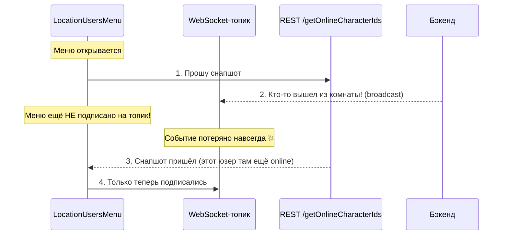
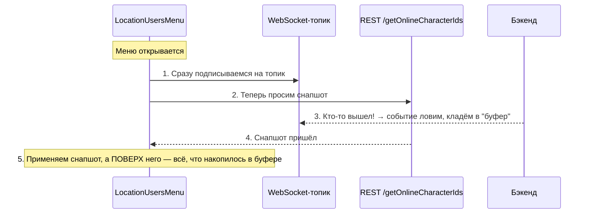
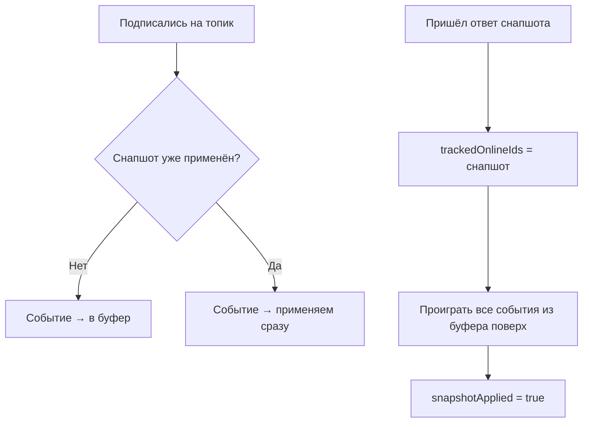
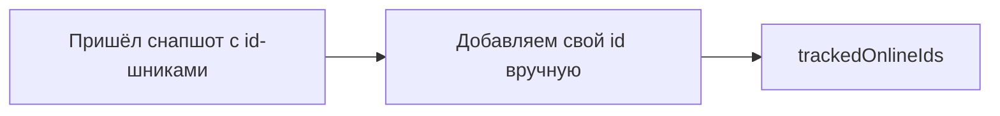
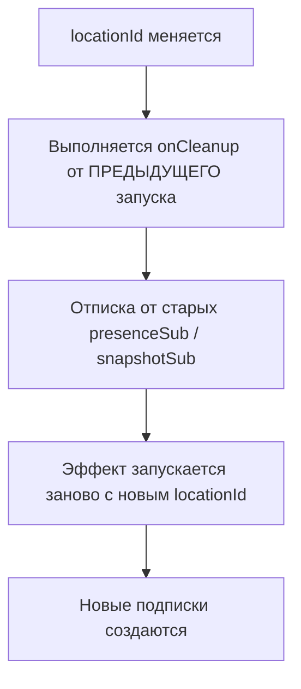

# Синхронизация онлайн-статусов в LocationUsersMenu — как это работает (для чайников)

## 1. В чём вообще была проблема (на пальцах)

Представь: ты открываешь меню "кто сейчас в доме" (`LocationUsersMenu`). Оно делает две вещи:

1. **Спрашивает у сервера по HTTP**: "дай список тех, кто сейчас онлайн" — это как сфотографировать комнату один раз (**снапшот**).
2. **Слушает "живую трансляцию"** через WebSocket: "если кто-то зашёл/вышел — скажи мне сразу" (**топик** `/topic/location.{id}.presence`).

Проблема в том, что фото (снапшот) и трансляция (топик) — это два разных канала, и они не гарантированно приходят в правильном порядке. Представь ситуацию:



Если подписаться на "трансляцию" **после** того, как сделан запрос за "фото" — есть шанс, что какое-то событие (кто-то вышел, кто-то зашёл) проскочит мимо в те несколько сотен миллисекунд, пока идёт HTTP-запрос. WebSocket-топик не хранит историю — если тебя не было в момент события, ты его **никогда не получишь повторно**.

## 2. Решение: сначала слушать, потом фотографировать

Простое правило: **нельзя начинать съёмку фото, пока не включена камера трансляции**.



Тогда неважно, что случится раньше — снапшот или событие в топике. Ничего не потеряется.

### Зачем нужен "буфер"

Представь, что снапшот — это фотоаппарат с задержкой затвора. Пока идёт затвор (HTTP-запрос летит туда-обратно), могут произойти события. Если применять их сразу "в лоб" — есть риск, что итоговое `.set()` от снапшота **перезапишет** и сотрёт то, что мы уже поправили по событию. Поэтому события, пришедшие **до** готовности снапшота, складываем в обычный массив ("буфер"), а применяем их **после** того, как снапшот применился — то есть уже поверх него, а не до.



## 3. А что с "я сам онлайн"?

Отдельная маленькая гонка: пока ты сам подключаешься по WebSocket (это занимает время — handshake, авторизация, и т.д.), сервер может ещё не успеть записать тебя "онлайн" в базу. Значит, снапшот в первую секунду может **не содержать тебя самого**.

Решение — не гнаться за точным моментом, а просто "дорисовать" себя вручную, раз ты и так точно знаешь, что раз меню открыто — значит, ты онлайн:



Это работает, потому что `Set` (множество) в JS не ломается от повторного добавления одного и того же элемента — если сервер позже всё равно пришлёт событие о тебе, ничего плохого не случится.

## 4. Итоговый код

```typescript
constructor() {
  effect((onCleanup) => {
    const locationId = this.locationId();
    const myCharacterId = this.authService.currentUser()!.userId;

    let snapshotApplied = false;
    const buffered: IPresenceEvent[] = [];

    // 1. Подписываемся на "трансляцию" СРАЗУ — раньше запроса за снапшотом
    const presenceSub = this.chatWebSocketService
      .topic<IPresenceEvent>(`/topic/location.${locationId}.presence`)
      .subscribe((event) => {
        if (!snapshotApplied) {
          buffered.push(event); // снапшот ещё не готов — копим "на потом"
        } else {
          this.updateLocationUsersMenu(event); // снапшот уже применён — обновляем сразу
        }
      });

    // 2. Только теперь идём за "фото"
    const snapshotSub = this.locationMembersService
      .getOnlineCharacterIds(locationId)
      .subscribe((ids) => {
        const idsSet = new Set(ids);
        idsSet.add(myCharacterId); // я точно онлайн, раз меню открыто
        this.trackedOnlineIds.set(idsSet);

        // 3. Проигрываем всё, что накопилось за время запроса, ПОВЕРХ снапшота
        buffered.forEach((e) => this.updateLocationUsersMenu(e));
        buffered.length = 0;
        snapshotApplied = true;
      });

    // 4. Уборка за собой при смене локации / уничтожении компонента
    onCleanup(() => {
      presenceSub.unsubscribe();
      snapshotSub.unsubscribe();
    });
  });
}

/** Точечно обновляет уже загруженный список и счётчик — без похода на бэк на каждое событие. */
private updateLocationUsersMenu(event: IPresenceEvent) {
  this.loadedUsers.update(users => {
    const index = users.findIndex(u => u.characterId === event.characterId);
    if (index === -1) return users; // юзер не в текущей загруженной странице — пропускаем

    const updated = [...users];
    updated[index] = {
      ...updated[index],
      online: event.online,
      roomId: event.online ? event.roomId : null,
      roomName: event.online ? this.resolveRoomName(event.roomId) : null,
      lastSeenAt: event.online ? null : new Date().toISOString(),
    };
    return updated;
  });

  this.trackedOnlineIds.update(ids => {
    const next = new Set(ids);
    event.online ? next.add(event.characterId) : next.delete(event.characterId);
    return next;
  });
}
```

## 5. Что такое `onCleanup` — простыми словами

`effect()` в Angular — это функция, которая перезапускается каждый раз, когда меняется сигнал, который она читает (в нашем случае — `locationId()`, то есть переход в другую локацию).

`onCleanup(callback)` — это способ сказать: **"перед тем как перезапустить этот эффект заново (или перед тем как компонент вообще уничтожится) — сначала выполни вот это"**.

Аналогия: представь, что каждый раз при входе в новую комнату ты сначала должен **выключить свет в старой комнате**, а уже потом включать свет в новой. `onCleanup` — это как раз "выключить свет в старой комнате": отписаться от старых WebSocket-подписок, чтобы они не продолжали работать параллельно с новыми и не приводили к дублированию/путанице данных.



Без этого при каждой смене локации старые подписки продолжали бы висеть в памяти и присылать обновления по уже неактуальной локации — утечка + рассинхрон данных.

## 6. Главные правила, которые мы вывели (шпаргалка)

### 🔹 Правило 1: сначала подписка на "живой" канал, потом снимок текущего состояния

**Почему:** иначе события, случившиеся в окне между запросом и ответом, теряются безвозвратно — WebSocket-топик не хранит историю и не ретранслирует прошлые события новым подписчикам.

---

### 🔹 Правило 2: буферизируй события, пока снапшот ещё не применён

**Почему:** финальный `.set()` снапшота **полностью перезаписывает** сигнал — если применить событие сразу, а потом снапшот перетрёт его своим значением, изменение потеряется. Буфер откладывает применение "на после снапшота".

---

### 🔹 Правило 3: про "себя" не жди специального события — добавляй сразу вручную

**Почему:** твоё собственное presence-событие может просто не успеть долететь, потому что WS-соединение (в другом компоненте) и подписка на топик (в этом компоненте) живут по независимому таймингу. Проще гарантированно добавить свой id в `Set`, чем гоняться за точным моментом.

---

### 🔹 Правило 4: не забывай `onCleanup` при смене локации/комнаты

**Почему:** без отписки старые подписки продолжат работать параллельно с новыми и путать состояние — утечка памяти плюс рассинхрон данных между "старой" и "новой" локацией.

---

### 🔹 Правило 5: обрабатывай `online: true` и `online: false` строго симметрично

**Почему:** ранний `return` на одной из веток (например, `if (event.online === false) return ids;`) — самая частая причина бага "счётчик растёт, но никогда не уменьшается". Обе ветки должны доходить до одинаковой логики обновления `Set`.

## 7. Известное ограничение (на будущее)

Сейчас при добавлении "себя" в снапшот (`idsSet.add(myCharacterId)`) мы чиним только счётчик (`trackedOnlineIds`), но не список `loadedUsers` — потому что для группировки по комнатам (`roomGroups`) нужны ещё `roomId`/`roomName`, а `getOnlineCharacterIds` их не возвращает. Если понадобится, чтобы список "кто в какой комнате" тоже сразу показывал тебя без задержки — стоит расширить бэкенд-эндпоинт, чтобы он возвращал не просто список id, а сразу объекты с `roomId`/`roomName`.
