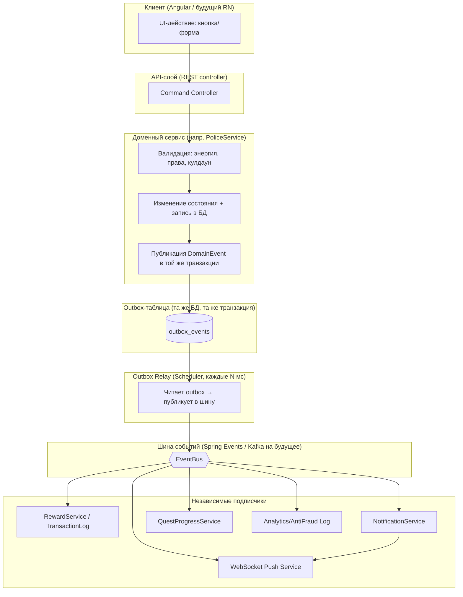
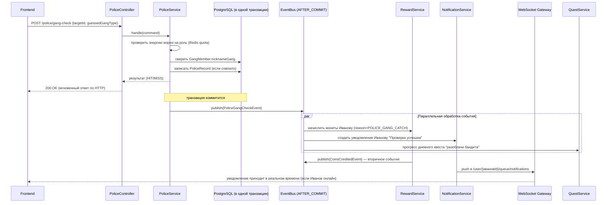
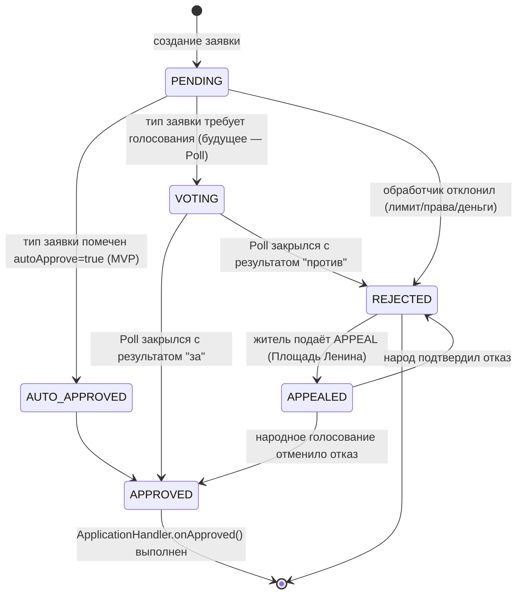
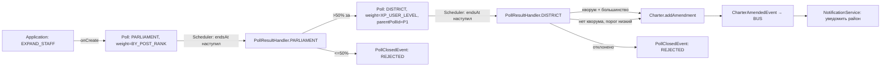
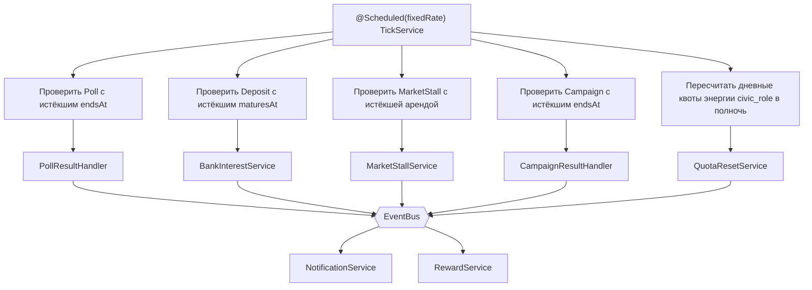
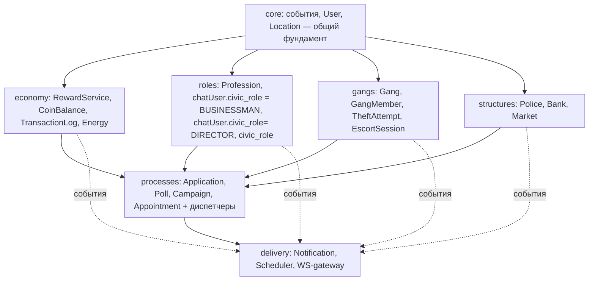

# BabichChat — архитектура событий, действий и уведомлений

> Дополнение к `babichchat_concept.md` и брифу для AI-разработчика. Отвечает на
> вопрос «как физически ходят данные»: от нажатия кнопки на фронте — через
> экономический/ролевой слой — до уведомления у другого пользователя.
>
> Общий принцип: **действие (Action) → доменный сервис → доменное событие
> (DomainEvent) → шина событий → множество независимых обработчиков**
> (Ledger, Notification, WebSocket-push, аналитика, шедулер-триггеры).
> Это то, чего не хватало в текущих документах — они описывают *сущности*,
> а не *путь события* между ними.

---

## 1. Почему именно событийная архитектура (Event-Driven), а не прямые вызовы

Ваша предметная область — это по сути **много слабо связанных подсистем,
реагирующих на одни и те же факты**: штраф полицейского меняет баланс жителя,
пишет запись в `PoliceRecord`, шлёт уведомление, возможно триггерит квест
«получи штраф» (шутка, но в целом — дневные квесты именно так и работают).

Если каждый сервис (`PoliceService`, `RewardService`, `NotificationService`,
`QuestService`) будет напрямую вызывать друг друга — вы получите то, от чего
уже предостерегает ваш же документ насчёт единой таблицы ролей: **жёсткую
связность**, которая при добавлении 6-й группировки или 2-й гражданской роли
потребует переписывать существующий код.

Правильный паттерн для вашего случая — **Transactional Outbox +
Domain Events**, реализуемый через Spring следующим образом:



**Почему именно outbox, а не просто `ApplicationEventPublisher` "в лоб":**
Spring умеет публиковать события синхронно в той же транзакции
(`@TransactionalEventListener`), и **для MVP этого достаточно** — не нужен
Kafka с первого дня. Но структуру полезно закладывать так, будто события уходят
во внешнюю шину: подписчики не знают друг о друге, событие — неизменяемый факт
с чётким контрактом полей. Тогда переход с монолитного `@EventListener` на
Kafka/RabbitMQ в будущем (например, когда понадобится React Native + пуши на
телефон в реальном времени, независимо от того, жив ли конкретный под с
Angular-сессией) — это **замена транспорта, а не переписывание бизнес-логики**.

**Рекомендация для MVP:** используйте `ApplicationEventPublisher` +
`@TransactionalEventListener(phase = AFTER_COMMIT)` — событие публикуется
гарантированно только если транзакция БД закоммитилась. Outbox-таблицу и relay
заводите отдельным шагом, когда появится несколько инстансов backend или
внешняя очередь — сам контракт событий (классы `*Event`) от этого не
поменяется.

---

## 2. Контракт события — единый для всех источников

Все доменные события должны наследоваться от одного базового контракта —
это то, что позволяет `NotificationService` и `QuestService` быть написанными
**один раз**, а не под каждый тип действия отдельно.

```java
abstract class DomainEvent {
    UUID eventId;
    Instant occurredAt;
    EventType type;        // WORK_SHIFT_DONE, POLICE_FINE_ISSUED, GANG_JOINED,
                            // POLL_CLOSED, DEPOSIT_MATURED, MARKET_SALE, ...
    Long actorId;           // кто совершил действие (characterId)
    Long targetId;          // nullable — на кого действие направлено
    ScopeType scopeType;     // DISTRICT / GANG / LOCATION / GLOBAL
    Long scopeId;
    Map<String, Object> payload; // специфичные для типа данные
}
```

Это прямое продолжение вашего принципа `RewardService(reason: ...)` из брифа —
просто вынесенное на уровень **до** `RewardService`, чтобы `RewardService` был
всего лишь одним из подписчиков на событие, а не точкой, которую обязаны
вызывать вручную из каждого сервиса.

---

## 3. Пример: полный путь одного действия («Оштрафовать»)

Это тот же сценарий из брифа (Иванов проверяет `pashaSelikhov`), но показан
как последовательность, а не список шагов — так виднее, где параллелизм,
а где обязательная синхронность.



Ключевой момент: **HTTP-ответ жителю не ждёт** уведомлений, квестов и т.п. —
он получает результат сразу после основной транзакции, а всё, что "происходит
вокруг" (награда, уведомление, квест), летит асинхронно через шину. Это и есть
то самое разделение, о котором вы пишете в разделе 7 брифа («Слой 3 → Слой 4»),
просто выраженное как конкретный технический механизм, а не только как
идея.

---

## 4. Заявки (`Application`) — Strategy + State Machine

У вас уже верно architected: `Application` с полем `type` + обработчик-стратегия
на каждый тип. Формализуем это как конечный автомат состояний плюс
диспетчер стратегий:



```java
interface ApplicationHandler {
    ApplicationType supports();
    ApplicationResolution onCreate(Application app);   // сразу авто-одобрить? отклонить? на голосование?
    void onApproved(Application app);                  // побочный эффект: выдать локацию, роль и т.д.
    void onRejected(Application app);                  // например, вернуть деньги, если списывались авансом
}

@Component
class ApplicationDispatcher {
    Map<ApplicationType, ApplicationHandler> handlers; // собирается Spring'ом автоматически по бинам

    void process(Application app) {
        handlers.get(app.getType()).onCreate(app);
        // при переходе в APPROVED/REJECTED — публикуется ApplicationResolvedEvent
    }
}
```

**Важно для расширяемости:** `onCreate` для MVP-типов (`BUY_FIRST_LOCATION`,
`JOIN_GANG`) сразу возвращает `AUTO_APPROVED`. Когда вы добавите реальное
голосование Парламента — меняется **только тело этого метода** у конкретного
хендлера (он теперь создаёт `Poll` вместо авто-одобрения), а весь остальной
код (диспетчер, состояния, эффекты `onApproved`) не трогается. Это ровно тот
контракт, о котором вы пишете в разделе 0.6 концепции.

---

## 5. Голосования (`Poll`) — каскад через тот же событийный контракт



`PollResultHandler` регистрируется по `PollType` тем же способом, что и
`ApplicationHandler` — по enum-ключу через `Map<PollType, PollResultHandler>`,
собираемый Spring'ом. Один интерфейс, один паттерн диспетчеризации на все
типы процессов Слоя 3 (`Application`, `Poll`, в будущем `Campaign`,
`Appointment`) — не изобретайте для каждого свой способ маршрутизации.

---

## 6. Шедулер (Слой 4) — единая точка всех time-based триггеров

Вместо разрозненных `@Scheduled`-методов в разных сервисах — один
`SchedulerGateway`, который знает **только "что пора проверить"**, а
конкретную логику отдаёт тем же хендлерам:



Практически: не пишите `@Scheduled` в `BankService`, `PoliceService` и
`MarketService` по отдельности с разными cron-выражениями "на глазок" — заведите
одну таблицу-реестр "что и когда проверять" (`ScheduledCheck`: entityType,
entityId, dueAt, checkType) и один общий `TickService`, который её вычитывает
пачками. Это дешевле по нагрузке на БД (один индексный запрос вместо N
полных сканов таблиц) и это единственное место, куда нужно будет добавить
Quartz/кластерную блокировку (`ShedLock`), когда backend перейдёт на несколько
инстансов — иначе один и тот же вклад закроется дважды.

---

## 7. Уведомления и связь backend ↔ frontend

У вас уже есть WebSocket для чата — переиспользуйте то же соединение для
уведомлений вместо отдельного канала (второй сокет = вторая точка отказа
и лишняя сложность на клиенте).

```mermaid
flowchart LR
    subgraph BE[Backend]
        NOT[NotificationService]
        WSG[STOMP Broker /user/queue/*]
    end
    subgraph FE[Angular / React Native]
        SOCK[Единое STOMP-соединение]
        BELL[Колокольчик в шапке]
        CHATWIN[Окно чата]
    end

    NOT -->|persist в БД: Notification read=false| DB[(notifications)]
    NOT -->|push| WSG
    WSG -->|/user/{id}/queue/notifications| SOCK
    WSG -->|/topic/location/{id}| SOCK
    SOCK --> BELL
    SOCK --> CHATWIN
    FE -->|при офлайне: GET /notifications?unread=true при коннекте| DB
```

**Правило разделения протоколов** (важно прописать AI-разработчику явно,
иначе получится каша):

| Тип взаимодействия | Протокол | Почему |
|---|---|---|
| Команды (работать, оштрафовать, подать заявку, купить) | REST POST/PUT, с ответом сразу | Нужна гарантия доставки, идемпотентность, HTTP-статусы ошибок, легко ретраить |
| Запросы состояния (баланс, профиль, лента заявок) | REST GET | Кэшируется, пагинируется |
| Сообщения в чате, live-обновления локации (кто зашёл/вышел) | WebSocket (STOMP over SockJS) | Низкая задержка, много мелких событий |
| Уведомления (колокольчик, "заявка одобрена", "вклад созрел") | WebSocket, тот же коннект, отдельный `/user/queue/notifications` + фолбэк персист в БД | Не теряются, если клиент офлайн — подгружаются при следующем коннекте |
| Долгие фоновые процессы (голосование идёт N дней) | Не нужен отдельный протокол — статус читается через обычный REST GET по `pollId`, а закрытие приходит уведомлением | Poll не "стримится" — это не realtime-сущность |

Мобильный React Native клиент (раздел "Стек" концепции) подключается к тому
же STOMP endpoint — разницы в контракте нет, только транспорт сокета в
фоне (для push, когда приложение свёрнуто, отдельно понадобится
интеграция с FCM/APNs — это уже не WebSocket, а отдельный `PushNotificationSender`,
подписанный на ту же шину событий, что и `NotificationService`, просто третий
подписчик на `EventBus` рядом с WS-гейтвеем).

---

## 8. Модульная граница кода (чтобы событийность не превратилась в кашу импортов)

Раз уж вы обозначили в брифе принцип "не смешивать роли даже в коде" —
логично довести это до границ модулей. Рекомендую Spring Modulith
(или просто дисциплинированные Java-пакеты с ArchUnit-тестами, если
Modulith пока не нужен):



Правило: `economy`, `roles`, `gangs`, `structures` **никогда не импортируют
друг друга напрямую** — только публикуют события в `core` и слушают чужие
события через интерфейсы `core`. Единственное разрешённое прямое
взаимодействие — вызов `RewardService` (он в `economy`, но его интерфейс
вынесен в `core`, как у вас уже и описано: "единая точка входа для любого
начисления"). Это ровно то, что защитит вас, когда группировок станет не
две, а шесть — новый модуль `gangs.dealers` не должен требовать правок в
`structures.police`.

---

## 9. Итоговая сводка паттернов (шпаргалка для разработчика)

| Задача | Паттерн | Где уже упомянуто в ваших доках |
|---|---|---|
| Начисления/списания | Единый сервис + explicit reason enum | `RewardService` (бриф, раздел 2.1) |
| Заявки любого типа | Strategy + диспетчер по enum | `ApplicationHandler` (концепция 0.6) |
| Голосования любого типа | Strategy + State Machine + каскад через parentPollId | `PollResultHandler` (бриф 7.3.2) |
| Побочные эффекты действия (награда/уведомление/квест) | Transactional Outbox / `@TransactionalEventListener(AFTER_COMMIT)` | Не описано явно — это добавка данного документа |
| Time-based переходы (закрытие Poll, созревание вклада, аренда) | Единый `TickService` + реестр `ScheduledCheck` вместо разрозненных `@Scheduled` | `Scheduler` (бриф, Слой 4) |
| Realtime доставка | STOMP over WebSocket, один коннект на чат+уведомления | Не описано явно — добавка |
| Кулдауны/энергия/квоты | Redis TTL | `бриф 2.3, концепция 3.3` — уже верно заложено |
| Границы модулей | Spring Modulith / пакеты без взаимных импортов, только через core-события | Развитие принципа "5 независимых таблиц ролей" (концепция 2, раздел 9) |

---

## 10. Что стоит добавить в план реализации (раздел 6 брифа)

Перед шагом 1 брифа («RewardService + TransactionLog») имеет смысл вставить
**шаг 0**: завести `core`-модуль с базовым `DomainEvent`, `EventBus`-обвязкой
(`@TransactionalEventListener`) и заготовкой `NotificationService` — даже
пустой (пишет в таблицу `notifications`, без пуша). Тогда каждый следующий
шаг брифа (профессия, заявки, банды, полиция, банк, рынок) с первого дня
публикует события в общий контракт, а не получает уведомления "довеском"
на шаге 7-9, когда придётся возвращаться и переписывать уже готовые
сервисы.
