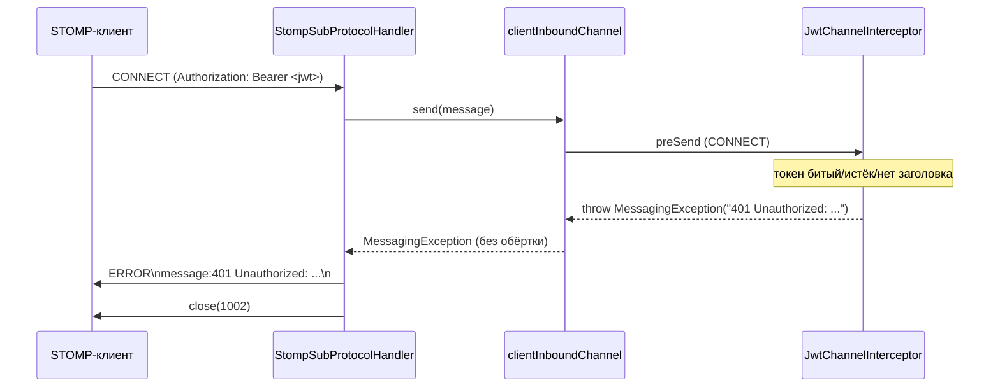

# WS CONNECT: отказ по аутентификации (401 в STOMP-ERROR-фрейме)

## Как устроена аутентификация WS в текущей реализации

- HTTP-апгрейд на `/ws` проходит **анонимно**: `SecurityConfig` разрешает `/ws/**` для всех
  (JWT-фильтр сервлетной цепочки на апгрейд не влияет).
- Аутентификация выполняется **один раз — на STOMP-`CONNECT`** в `JwtChannelInterceptor`
  (интерсептор `clientInboundChannel`, регистрируется в `WebSocketConfig.configureClientInboundChannel`).
- Principal на всю сессию ставится через `StompHeaderAccessor.setUser(...)`.
- Токен берётся из native-заголовка `Authorization: Bearer <jwt>` CONNECT-фрейма.
- Проверка токена — это вызов `JwtService.extractUsername(token)`: он парсит JWS и валидирует
  подпись и срок, поэтому отдельная проверка `isTokenValid` в интерсепторе не нужна.
- Раз токен читается только на `CONNECT`, истечение токена **не рвёт уже открытую сессию**:
  обрыв происходит лишь при следующем (ре)коннекте.

## Контракт отказа: почему кидается именно MessagingException

При любой проблеме (нет заголовка `Authorization`, токен истёк, токен битый, пользователь
не найден) интерсептор бросает `org.springframework.messaging.MessagingException` с текстом
вида `401 Unauthorized: <причина>`.

Это принципиально, потому что дальше работает непрозрачная для прикладного кода цепочка Spring:

1. `AbstractMessageChannel.send(...)` (spring-messaging) перебрасывает `MessagingException`
   **как есть**; любое другое исключение заворачивается в `MessageDeliveryException`
   с generic-текстом `Failed to send message to <channel>` (текст причины там только в cause).
2. `StompSubProtocolHandler.sendErrorMessage(...)` — вызывается, когда у эндпоинта **не задан**
   `StompSubProtocolErrorHandler` — кладёт `exception.getMessage()` в заголовок `message`
   STOMP-ERROR-фрейма и закрывает сессию кодом `1002` (PROTOCOL_ERROR).

Итог: только `MessagingException` даёт клиенту в заголовке `message` осмысленный текст
`401 Unauthorized: ...`, по которому фронт может отличить auth-ошибку от прочих сбоев.

## Парная логика на клиенте

`StompConnectionService` (Angular) завязан на этот контракт:

- `beforeConnect` — заголовок `Authorization` переподставляется **перед каждой попыткой
  коннекта**, включая реконнекты (заголовки, заданные один раз при создании `Client`,
  при реконнекте не перечитываются).
- `onStompError` — если в `message` ERROR-фрейма есть `401`/`Unauthorized`, вызывается
  `handleAuthError()`: `AuthService.clearSession()` → `router.navigate(['/login'])`,
  `client.reconnectDelay = 0` и `deactivate()`.
- `onWebSocketClose` — в этом auth-сценарии ссылка на клиент обнуляется, чтобы после
  повторного логина `ensureClient()` создал новый клиент с новым токеном
  (иначе `ensureClient()` вернулся бы на непустом клиенте и соединение не поднялось бы без F5).
- `onWebSocketError` — тот же `handleAuthError()`, если токена нет вообще.

## Как проявлялась проблема, из-за которой это было переделано

До правки `preSend` вызывал `extractUsername` без `try/catch`, и на просроченном токене
`ExpiredJwtException` улетал наружу: Spring слал клиенту ERROR с generic-текстом
(без `401`), сессия закрывалась кодом `1002`, а фронт не распознавал auth-ошибку и
переподключался каждые 5 секунд тем же просроченным токеном — бесконечный цикл в логах
бэкенда. Всплывало это при перезапуске приложения: живая WS-сессия с уже истёкшим токеном
до перезапуска продолжала работать (аутентификация была пройдена раньше), а после
перезапуска начинались реконнекты с истёкшим токеном.
