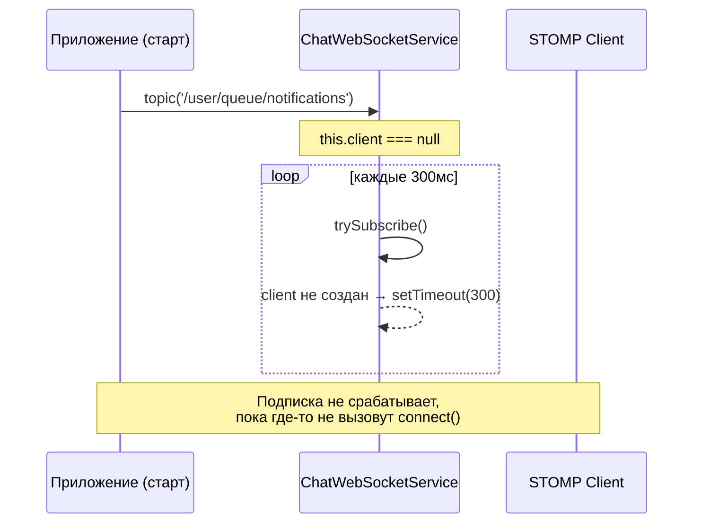
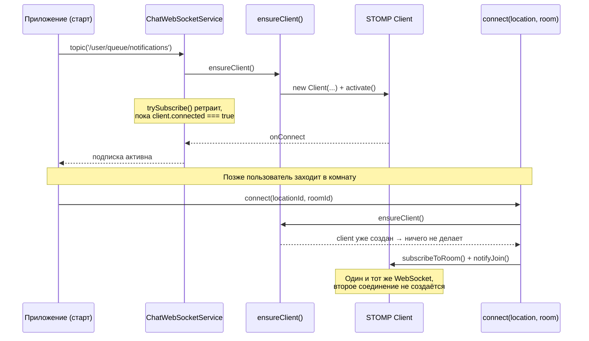

# Доработка ChatWebSocketService: подписка на topic() до входа в комнату

## Проблема

`ChatWebSocketService` создаёт STOMP-клиента (`this.client`) только внутри
метода `connect(locationId, roomId)`. Метод `topic<T>(topic)` спроектирован
так, чтобы дожидаться подключения уже существующего клиента (ретрай каждые
300 мс), но сам клиента не создаёт.

Если пользователь ещё не входил ни в одну комнату (например, только что
открыл приложение и хочет сразу слушать личный топик уведомлений), то:

- `this.client === null`;
- `topic()` уходит в бесконечный цикл `setTimeout(trySubscribe, 300)`;
- подписка никогда не срабатывает, пока где-то не будет вызван `connect()`.

### Схема проблемы (было)



## Решение

Вынести создание и активацию STOMP-клиента в отдельный переиспользуемый
метод `ensureClient()`, не зависящий от `roomId` / `locationId`. Он:

- создаёт `Client` и вызывает `activate()`, только если клиента ещё нет;
- при `onConnect` дополнительно проверяет, известны ли уже `roomId` /
  `locationId` (на случай, если они были выставлены раньше), и довходит
  в комнату, если да.

`connect()` и `topic()` теперь оба вызывают `ensureClient()` вместо того,
чтобы `connect()` был единственной точкой создания сокета.

### Схема решения (стало)



## Изменения в коде

### Новый метод `ensureClient()`

```typescript
/** Создаёт и активирует WS-соединение, если оно ещё не создано.
 *  Можно (и нужно) вызывать до входа в любую комнату/локацию. */
private ensureClient(): void {
  if (this.client) return; // уже создаётся/создан

  this.client = new Client({
    brokerURL: `${location.protocol === 'https:' ? 'wss' : 'ws'}://${location.host}/ws`,
    connectHeaders: { Authorization: `Bearer ${this.auth.getToken()}` },
    reconnectDelay: 5000,

    onConnect: () => {
      this.connected.set(true);
      this.startHeartbeat();
      // если к этому моменту уже знаем комнату — довходим в неё
      if (this.currentRoomId && this.currentLocationId) {
        this.subscribeToRoom(this.currentRoomId);
        this.notifyJoin(this.currentLocationId, this.currentRoomId);
      }
    },

    onDisconnect: () => {
      this.connected.set(false);
      this.stopHeartbeat();
    },

    onUnhandledMessage: (msg: IMessage) => console.error('Unhandled message', msg),

    onStompError: (frame: IFrame) => {
      console.error('STOMP error', frame);
      const errorMsg = (frame.headers?.['message'] || frame.body || '').toString();
      if (errorMsg.includes('401') || errorMsg.includes('Unauthorized')) this.handleAuthError();
    },

    onWebSocketError: (event: Event | ErrorEvent) => {
      console.error('WebSocket error', event);
      if ((event as ErrorEvent).message?.includes('401') || !this.auth.getToken()) this.handleAuthError();
    },

    onWebSocketClose: () => {
      this.stopHeartbeat();
      if (this.authFailed && this.client) {
        this.client.deactivate();
        this.authFailed = false;
      }
    },
  });

  this.client.activate();
}
```

### `connect()` — теперь тонкая обёртка над `ensureClient()`

```typescript
connect(locationId: string, roomId: string): void {
  if (this.client?.active) {
    this.switchRoom(locationId, roomId);
    return;
  }
  this.currentRoomId = roomId;
  this.currentLocationId = locationId;
  this.ensureClient();
}
```

### `topic()` — вызывает `ensureClient()` перед началом ретраев

```typescript
topic<T>(topic: string): Observable<T> {
  this.ensureClient(); // ← ключевое добавление

  return new Observable<T>((subscriber) => {
    let sub: StompSubscription | null = null;
    let cancelled = false;

    const trySubscribe = () => {
      if (cancelled) return;
      if (this.client?.connected) {
        sub = this.client.subscribe(topic, (message: IMessage) => {
          subscriber.next(JSON.parse(message.body) as T);
        });
      } else {
        setTimeout(trySubscribe, 300);
      }
    };

    trySubscribe();

    return () => {
      cancelled = true;
      sub?.unsubscribe();
    };
  });
}
```

## Как это работает в разных сценариях

| Сценарий | Поведение после доработки |
|---|---|
| Юзер сразу вызывает `topic('/user/queue/notifications')`, ни разу не заходя в комнату | `ensureClient()` создаёт и активирует сокет; `trySubscribe` дожидается `onConnect` и подписывается |
| Юзер сразу заходит в комнату через `connect(locationId, roomId)` | Как и раньше — сокет создаётся через `ensureClient()`, происходит `subscribeToRoom` + `notifyJoin` |
| Сначала `topic()`, потом `connect()` | Сокет уже создан и, возможно, уже подключён → `connect()` увидит `this.client?.active === true` и вызовет `switchRoom(...)`, переиспользуя то же соединение |
| Сначала `connect()`, потом сторонний `topic()` (например, для presence) | `ensureClient()` увидит, что `this.client` уже существует, и ничего не пересоздаст |

Второй WebSocket никогда не создаётся — соединение всегда одно на клиента.

## Важный нюанс: авторизация

Если `ensureClient()` вызывается **до** того, как `AuthService` гарантированно
получил токен (`this.auth.getToken()` возвращает `null`/`undefined`),
подключение упадёт с `401` в `onStompError` / `onWebSocketError`.

Рекомендации:

- вызывать `topic()` для ранних (pre-room) подписок только после того, как
  залогиненность подтверждена (например, после `AuthGuard` / после получения
  профиля пользователя);
- либо добавить защитную проверку в начало `ensureClient()`:

```typescript
private ensureClient(): void {
  if (this.client) return;
  if (!this.auth.getToken()) return; // подписка отложится до появления токена
  // ...
}
```

В этом случае `topic()` продолжит ретраить `trySubscribe`, но реального
подключения не будет, пока токен не появится и `ensureClient()` не будет
вызван повторно (например, из `connect()` позже, или из явного ре-триггера
после логина).

## Итог

- `ensureClient()` — единая точка создания STOMP-клиента, не завязанная на
  конкретную комнату/локацию.
- `connect()` и `topic()` теперь оба безопасно инициируют соединение, не
  дублируя его.
- Ранние подписки (уведомления, presence и т.п.) работают сразу при
  старте приложения, независимо от того, зашёл ли пользователь в комнату.
