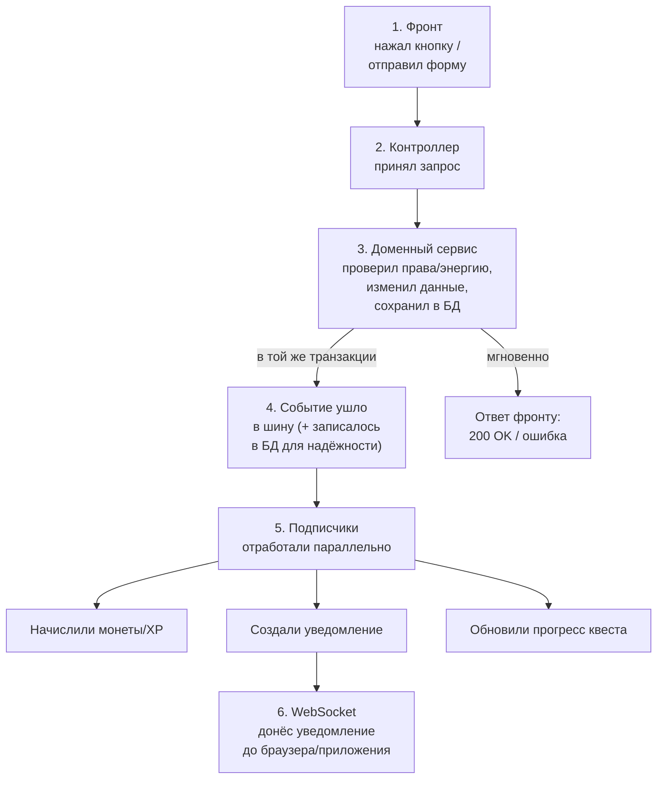

# Шпаргалка: как данные идут от фронта до конца

> Держи под рукой, когда забудешь, «а что вообще происходит после того,
> как я нажал кнопку». Разбито на 6 простых шагов + 1 диаграмма.

---

## Общая картина одним взглядом

**Главное, что нужно запомнить:** фронт получает ответ **сразу после шага 3**,
не дожидаясь начисления, уведомления и квестов — они происходят рядом,
асинхронно. Поэтому кнопка не «висит», пока где-то там начисляются монеты.

---

## Шаг за шагом — что происходит физически

### 1. Фронт отправляет действие
Пользователь нажал «Оштрафовать», «Купить локацию», «Пойти на смену» —
неважно что. Фронт (Angular сейчас, React Native потом) отправляет
**обычный HTTP-запрос** (`POST /police/fine`, `POST /work/shift` и т.п.)
на бэкенд. Никакой магии — как в любом обычном сайте.

### 2. Контроллер принимает запрос
Просто «дверь» в бэкенд — принял JSON, проверил формат, передал дальше
в нужный сервис (`PoliceService`, `WorkService`, `ApplicationService`...).
Сам ничего не решает.

### 3. Доменный сервис делает основную работу
Здесь происходит вся суть действия:
- проверяет, хватает ли энергии, есть ли права на это действие, не сработал
  ли кулдаун;
- меняет данные и сохраняет их в базу (например, пишет `PoliceRecord`);
- всё это — **одна транзакция базы данных**. Либо всё сохранилось, либо
  ничего (если что-то пошло не так — откат).

Сразу после этого фронт получает ответ (**успех/ошибка**) — дальше он
свободен, ждать больше нечего.

### 4. Публикуется событие
Как только транзакция из шага 3 успешно закоммитилась — сервис публикует
**событие** («штраф выписан», «смена завершена», «заявка одобрена»).

Это событие:
- летит дальше как обычный Java-объект в памяти (быстро);
- **и одновременно** записывается в отдельную таблицу в базе
  (`event_publication`) — это наша страховка. Если сервер вдруг упадёт
  прямо в этот момент — событие не потеряется, при следующем запуске
  сервер сам увидит незавершённую запись и доделает работу.

*(Технически это даёт библиотека Spring Modulith — писать таблицу и логику
восстановления руками нам не пришлось.)*

### 5. Подписчики реагируют — каждый занимается своим делом
На одно событие может «отозваться» несколько независимых частей системы,
и они не знают друг о друге:
- **Начисление** — если событие подразумевает награду, зачисляются
  монеты/XP, пишется запись в журнал транзакций;
- **Уведомления** — создаётся запись «уведомление для пользователя»;
- **Квесты** — если действие засчитывается в дневной квест — прогресс
  двигается;
- **Анти-фрод/аналитика** — событие логируется для будущего анализа.

Все они происходят **параллельно и независимо** — если, например, отвалится
модуль квестов, начисление монет и уведомление всё равно дойдут.

### 6. Уведомление долетает до пользователя в реальном времени
Если один из подписчиков создал уведомление — оно отправляется через
**WebSocket** (то же самое соединение, что уже используется для чата) прямо
в браузер/приложение пользователя, и там всплывает «колокольчик» / пуш —
без перезагрузки страницы. Если пользователь сейчас офлайн — уведомление
просто лежит в базе и подгрузится, когда он в следующий раз зайдёт.

---

## Пример на реальном сценарии из документации

**Сценарий:** полицейский проверяет подозреваемого в связи с бандой и
попадание оказывается верным.

| Шаг | Что происходит |
|---|---|
| 1 | Фронт отправляет `POST /police/gang-check` |
| 2 | `PoliceController` принял запрос |
| 3 | `PoliceService` проверил энергию мэрии, сверил данные, записал `PoliceRecord`, транзакция закоммитилась → фронт получил `200 OK` |
| 4 | Публикуется `PoliceGangCheckEvent`, событие сохранено в `event_publication` |
| 5 | Параллельно: `RewardService` начисляет монеты полицейскому; `NotificationService` готовит уведомление «Проверка успешна»; `QuestService` двигает прогресс квеста «разоблачи бандита» |
| 6 | Уведомление летит через WebSocket полицейскому — если он онлайн, видит его сразу |

---

## Кто с кем говорит — короткое правило

- **Команды** (что-то сделать: купить, оштрафовать, подать заявку) —
  обычный HTTP-запрос, ответ приходит сразу.
- **Чат и «кто зашёл в комнату»** — WebSocket, потому что это часто и быстро.
- **Уведомления** («заявка одобрена», «вклад созрел») — тоже WebSocket,
  тот же самый коннект, что и у чата (два отдельных сокета не заводим).
- **Долгие процессы** (голосование идёт несколько дней) — не «висят» на
  сокете, а просто проверяются обычным запросом по id, когда нужно; когда
  голосование закроется — придёт уведомление тем же путём, что и всё
  остальное (шаг 5-6).

---

## Что помнить, если что-то не работает

- Если действие сохранилось, а **уведомление не пришло** — проблема не в
  шаге 3 (он точно отработал, раз фронт получил ответ), а где-то в шагах
  4-6. Смотреть таблицу `event_publication` — если там есть незавершённая
  запись без `completion_date`, значит слушатель не отработал или ещё не
  успел.
- Если **монеты не начислились, хотя действие прошло** — то же самое,
  проблема не в основном сервисе, а в подписчике `RewardService` на событие.
- Основное правило: **шаг 3 — это то, что обязано сработать всегда и сразу**
  (иначе откатится вся транзакция). **Шаги 4-6 — это «довесок», который
  почти всегда срабатывает сразу, но формально может задержаться на доли
  секунды** — и это нормально, так и задумано.
