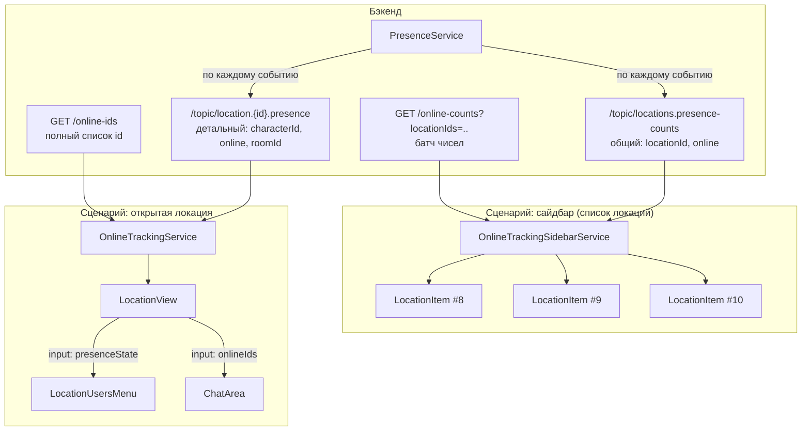
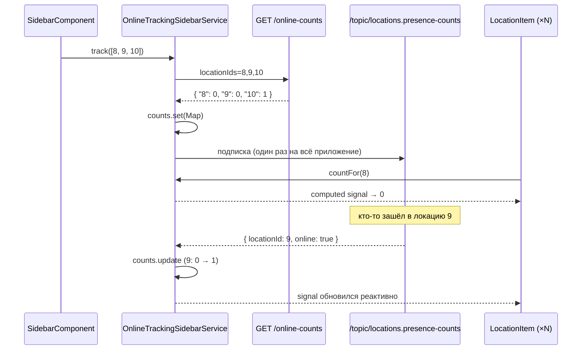
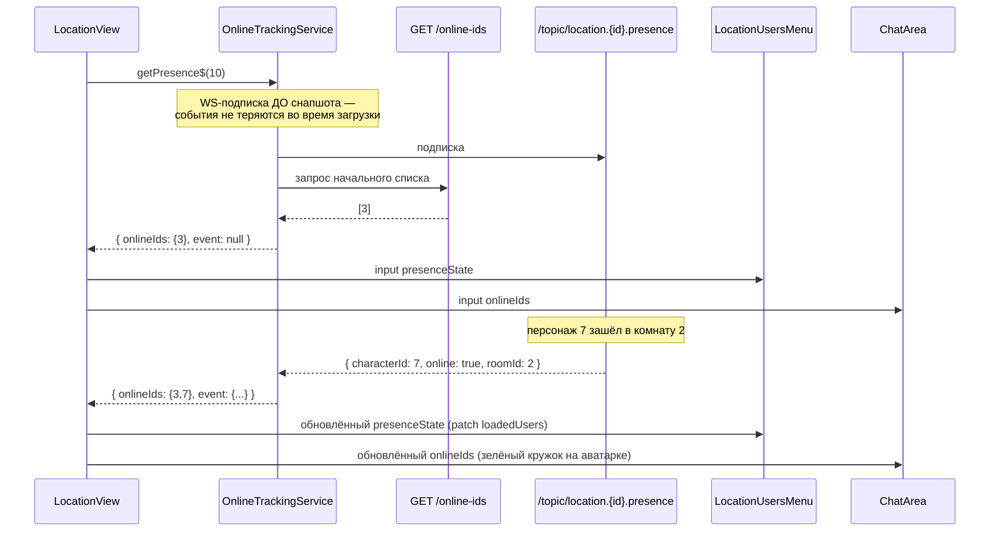
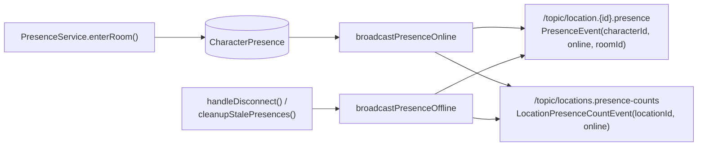

# Архитектура online-tracking (онлайн-статусы)

## Проблема, которую решаем

В приложении есть два принципиально разных сценария использования "кто онлайн":

1. **Список локаций в сайдбаре** — нужно только число онлайн-пользователей на каждую локацию (может быть десятки локаций одновременно на экране).
2. **Открытая локация** — нужен полный список id пользователей + детальные события (кто зашёл, в какую комнату, кто вышел), чтобы patch-ить список участников и красить индикаторы онлайна на аватарках.

---

## Общая схема

---

## Сценарий 1: Сайдбар со списком локаций

**Задача:** показать `👥 N` рядом с каждой локацией в списке, для потенциально большого числа локаций разом.

**Принцип:** один батч-запрос на весь видимый список + один общий WS-топик на всё приложение, а не по одному на локацию.

### Компоненты

| Файл | Роль |
|---|---|
| `OnlineTrackingSidebarService` | Единственный держатель `Map<locationId, count>`, батч-HTTP + один WS-топик |
| `LocationItem` | Просто читает `countFor(locationId)` — не знает про HTTP/WS вообще |

### Ключевые решения

- **`track(locationIds)`** вызывается один раз родительским компонентом списка, когда известен полный набор id локаций.
- **WS-подписка на `/topic/locations.presence-counts` устанавливается один раз** (`ensureGlobalTopicSubscribed`) и живёт всё время работы приложения — не пересоздаётся при каждом вызове `track`.
- **Фильтрация по `trackedIds`** — сервис получает события по *всем* локациям всех пользователей, но обновляет счётчик только для тех id, которые реально отслеживаются (есть в сайдбаре).
- Счётчик локации, где никого нет, всё равно присутствует в ответе (со значением `0`) — важно, чтобы UI не показывал "нет данных" вместо честного нуля.

---

## Сценарий 2: Открытая локация

**Задача:** показать полный список участников, их комнаты, состояние online/offline в реальном времени — для одной конкретно открытой локации.

**Принцип:** один общий поток presence на весь `LocationView`, расшариваемый через `shareReplay({ refCount: true })` между всеми дочерними компонентами (`LocationUsersMenu`, `ChatArea` и их потомками) — вместо того чтобы каждый дочерний компонент сам ходил в сервис.

### Компоненты

| Файл | Роль |
|---|---|
| `OnlineTrackingService` | Кеш `Map<locationId, Observable<LocationPresenceState>>`, снапшот + буферизация событий до применения снапшота, `shareReplay({ refCount: true })` |
| `LocationView` | **Единственная точка подписки** на `getPresence$` для этой локации; раздаёт данные вниз через `input` |
| `LocationUsersMenu` | Получает `presenceState` через `input`, не обращается к сервису напрямую |
| `ChatArea` (и вложенные аватарки) | Получает `onlineIds` через `input`, красит индикатор онлайна |

### Ключевые решения

- **Кеш по `locationId` + `shareReplay({ refCount: true })`** — сколько бы компонентов ни подписалось на одну и ту же локацию, реальный HTTP-запрос и WS-подписка происходят один раз; при отписке последнего подписчика поток и WS-подписка закрываются автоматически.
- **Подписка на WS-топик устанавливается ДО запроса снапшота** — события, пришедшие в момент между открытием WS и получением HTTP-ответа, не теряются, а буферизуются и применяются сразу после снапшота.
- **Поднятие подписки на уровень `LocationView`** — раньше и `LocationUsersMenu`, и `ChatArea` независимо вызывали `getPresence$`/`getOnlineIds$`, из-за чего на одну локацию приходилось 2+ подписчика внутри одного и того же поддерева компонентов. Теперь один сигнал `presenceState`/`onlineIds` считается в `LocationView` и спускается вниз как `input` — компоненты-потомки становятся "глупыми" и ничего не знают про сервис.

---

## Бэкенд: откуда берутся данные

### Эндпоинты

| Метод | URL | Возвращает | Используется в |
|---|---|---|---|
| `GET` | `/api/location-members/{locationId}/online-ids` | `List<Long>` — полный список id | `OnlineTrackingService` (снапшот) |
| `GET` | `/api/location-members/online-counts?locationIds=8,9,10` | `Map<Long, Long>` — счётчики батчем | `OnlineTrackingSidebarService` |

### WS-топики

| Топик | Payload | Кто слушает |
|---|---|---|
| `/topic/location.{id}.presence` | `PresenceEvent(characterId, online, roomId)` | `OnlineTrackingService`, по одной подписке на открытую локацию |
| `/topic/locations.presence-counts` | `LocationPresenceCountEvent(locationId, online)` | `OnlineTrackingSidebarService`, одна подписка на всё приложение |

Каждое presence-событие на бэке (`broadcastPresenceOnline`/`broadcastPresenceOffline`) рассылается **в оба топика одновременно** — так оба сценария (сайдбар и открытая локация) получают актуальные данные без дублирования HTTP/WS-инфраструктуры на бэке.

---

## Итоговое сравнение сценариев

| | Сайдбар | Открытая локация |
|---|---|---|
| Сервис | `OnlineTrackingSidebarService` | `OnlineTrackingService` |
| Данные | `Map<locationId, count>` | `Set<characterId>` + события |
| HTTP | 1 батч-запрос на весь список | 1 запрос на локацию (закешированный) |
| WS | 1 общий топик на всё приложение | 1 топик на локацию (закешированный) |
| Кто подписывается | Родитель списка (`track()`), читают все `LocationItem` | `LocationView`, читают потомки через `input` |
| Что получает конечный компонент | Число | Полный набор id + детали события |
