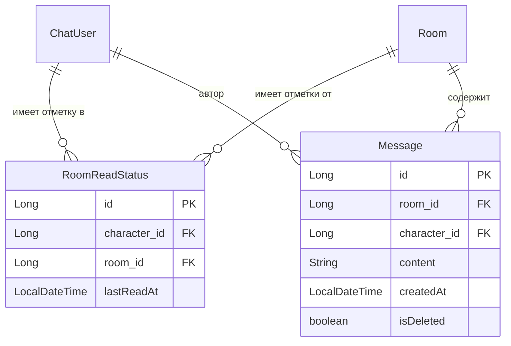
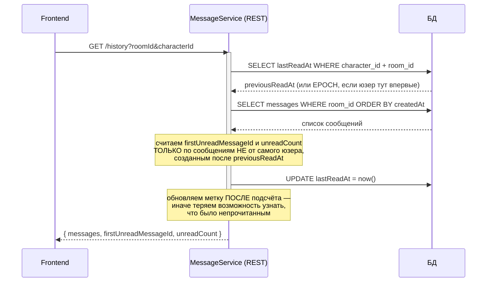
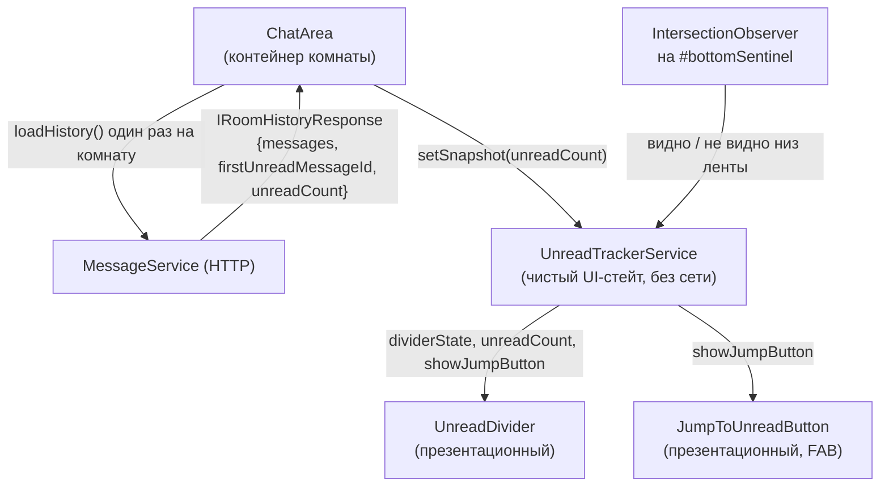
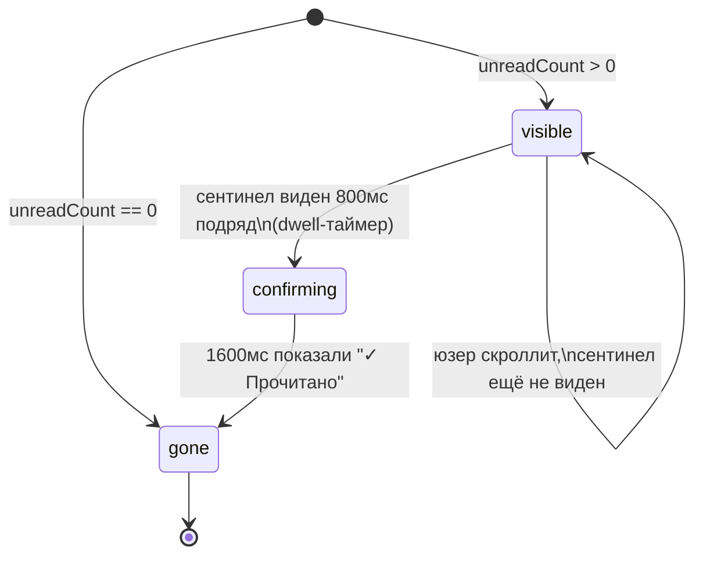
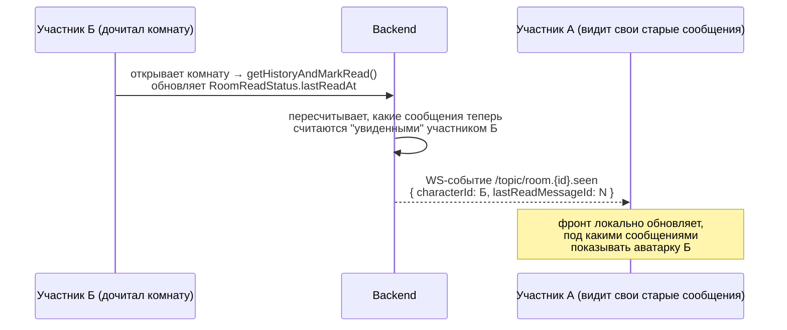

# Логика "непрочитанных сообщений" — как это работает и куда движемся

## 1. Идея в двух словах

Есть два независимых слоя, которые часто путают друг с другом:

- **Read status (реализовано)** — "докуда лично Я дочитал комнату". Хранится как одна метка времени на пару `(персонаж, комната)`. Отвечает на вопрос *"что я пропустил с прошлого раза"*.
- **Seen by (план)** — "кто из участников комнаты видел конкретное сообщение". Отвечает на вопрос *"видели ли остальные то, что я написал"*. Это отдельная фича, надстройка над тем же фундаментом.

Сейчас документ фиксирует первый слой (уже в проде) и намечает архитектуру для второго.

---

## 2. Модель данных (текущая)



Уникальный индекс `(character_id, room_id)` — на пару персонаж+комната ровно одна запись. Никакой истории "прочтений" не хранится, только последний снапшот.

---

## 3. Бэкенд: атомарное чтение истории + пометка прочитанным

Ключевое решение — `getHistoryAndMarkRead()` в `MessageService` делает всё **в одной транзакции**, чтобы не зависеть от порядка двух независимых сетевых вызовов (раньше было отдельно "войти в комнату по WS" + "загрузить историю по HTTP", и это давало гонку).



**Важное свойство: операция не идемпотентна.** Повторный вызов для той же комнаты сразу после первого всегда вернёт `firstUnreadMessageId = null` — метка уже сдвинута. Поэтому фронт обязан вызывать `loadHistory()` **ровно один раз** за сессию открытой комнаты (см. раздел 5, `lastLoadedRoomId`).

---

## 4. Фронтенд: от ответа бэка до анимации в UI

### 4.1 Кто за что отвечает



Разделение ответственности:
- **`ChatArea`** — знает про HTTP/WS, комнаты, сообщения. Дёргает `unreadTracker.setSnapshot()` один раз после загрузки истории.
- **`UnreadTrackerService`** — НЕ ходит в сеть. Бэк уже всё посчитал и уже пометил прочитанным в момент HTTP-ответа. Сервис только красиво это анимирует и решает, когда убрать разделитель / показать FAB.
- **`UnreadDivider` / `JumpToUnreadButton`** — глупые презентационные компоненты, только рендерят пропсы.

### 4.2 Состояния разделителя



Почему именно так:
- **800мс dwell** — защита от случайного мелькания низа ленты во время быстрого скролла мимо. Разделитель не должен "засчитываться" прочитанным, если пользователь просто пролистнул колесом мыши.
- **1600мс на "✓ Прочитано"** — пользователь должен успеть заметить переход состояния, иначе баг "прочитано появилось и тут же пропало" (было замечено на практике при первой версии в 900мс).
- Проверка видимости сентинела делается **и при подключении observer'а** (`checkVisibilityNow()`), а не только при будущих пересечениях — иначе если сообщений мало и вся лента помещается на экран без скролла, `IntersectionObserver` никогда не стрельнёт колбэком, и разделитель зависает навсегда.

### 4.3 Защита от повторной загрузки истории

```typescript
private lastLoadedRoomId: number | null = null;

effect(() => {
  const room = this.room();
  if (!room) return;
  this.chatWebSocketService.connect(...); // presence — можно вызывать многократно

  if (this.lastLoadedRoomId !== room.id) {   // ← история — только один раз на комнату
    this.lastLoadedRoomId = room.id;
    this.loadHistory(room.id);
  }
});
```

Angular `effect()` перезапускается при любом изменении *ссылки* на входной сигнал (`room()`), даже если `room.id` не поменялся (например, родитель пересоздал объект `room` из-за не связанного ре-рендера). Без этой защиты каждый лишний перезапуск эффекта повторно вызывал бы неидемпотентный `getHistoryAndMarkRead` и молча "съедал" непрочитанные без того, чтобы пользователь их увидел.

### 4.4 "Докрутка впритык"

`IntersectionObserver` использует `threshold: 1.0` (не `0.95`) + сентинел с `flex-shrink: 0` и ненулевой высотой (4px). Это гарантирует, что "видно" засчитывается только при полном попадании сентинела в viewport, а не при приближении к низу.

---

## 5. Итоговая карта файлов

```
chat-area/
├── chat-area.ts                          — контейнер: WS, HTTP, комнаты
├── chat-area.html
├── chat-area.scss
├── unread-divider/
│   ├── unread-divider.ts                 — презентационный, input: state + count
│   ├── unread-divider.html
│   └── unread-divider.scss
└── jump-to-unread-button/
    ├── jump-to-unread-button.ts          — презентационный, input: count, output: jump
    ├── jump-to-unread-button.html
    └── jump-to-unread-button.scss

services/frontend-services/messages/
└── unread-tracker.service.ts             — providers: [] у ChatArea (свой инстанс на комнату)

backend: service/message/MessageService.java
  └── getHistoryAndMarkRead()             — атомарная транзакция чтение+пометка

backend: entity/RoomReadStatus.java
backend: repository/room/RoomReadStatusRepository.java
```

---

## 6. План: "seen by" (кто видел сообщение) — следующий этап

### 6.1 Зачем это отдельный этап

`RoomReadStatus` уже даёт всё необходимое как фундамент — новых таблиц не нужно. Но задача принципиально другая:

| | Read status (сделано) | Seen by (план) |
|---|---|---|
| Вопрос | "Что пропустил я?" | "Кто видел это сообщение?" |
| Гранулярность | 1 метка на (юзер, комната) | Нужно сопоставить метку **каждого** участника с **каждым** сообщением |
| Where | Считается один раз при входе в комнату | Нужно пересчитывать при каждом новом входе любого участника |
| UI | Разделитель + FAB, разовая штука | Аватарки под сообщением, обновляются в реальном времени |

### 6.2 Идея вычисления (без новых таблиц)

Для сообщения `msg` список "видевших" — это все участники комнаты, чей `RoomReadStatus.lastReadAt >= msg.createdAt`:

```sql
SELECT rrs.character_id
FROM room_read_status rrs
WHERE rrs.room_id = :roomId
  AND rrs.last_read_at >= :messageCreatedAt
  AND rrs.character_id != :messageAuthorId
```

Практично считать это не для каждого сообщения отдельно, а один раз для **последнего** сообщения в каждой "пачке подряд идущих от одного автора" — как делает Telegram (аватарки показываются только под последним сообщением группы, не под каждым).

### 6.3 Как узнавать об этом в реальном времени



Никакого нового REST-опроса не нужно — при каждом успешном `getHistoryAndMarkRead()` бэк дополнительно рассылает **одно** WS-сообщение в комнату о том, что персонаж X теперь видел всё до сообщения с таким-то id. Фронт всех остальных участников комнаты просто обновляет локальный маппинг `characterId → lastSeenMessageId` и перерисовывает аватарки под нужными сообщениями — без похода на сервер.

### 6.4 Что понадобится добавить (когда перейдём к реализации)

- Бэк: в конце `getHistoryAndMarkRead()` — `messagingTemplate.convertAndSend("/topic/room." + roomId + ".seen", ...)`.
- Фронт: новая подписка в `ChatWebSocketService` на `/topic/room.{id}.seen`, сигнал `seenStatusByCharacter: Map<characterId, lastReadMessageId>`.
- UI: маленький компонент `SeenByAvatars` — вывод 1-3 аватарок под последним сообщением группы, с overflow `+N` при большом числе участников (см. референс с Telegram-скрина — `2 просмотра` + стопка аватарок).
- Решить: показывать это только для собственных сообщений (как в Telegram — "кто видел то, что я написал") или для всех сообщений в ленте — это влияет и на приватность, и на объём данных, гоняемых по WS.

Этот раздел — черновой план, не финальная спецификация. Перед реализацией стоит отдельно обсудить пункт про приватность (не все чаты обязаны показывать read receipts другим) и решить, нужна ли настройка "отключить отметки о прочтении" на уровне комнаты/локации.
