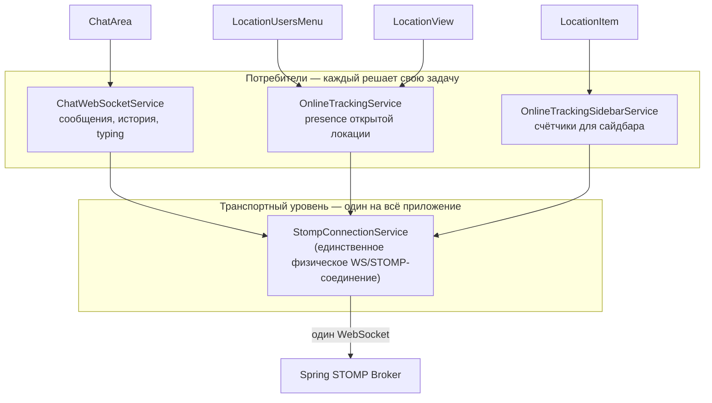
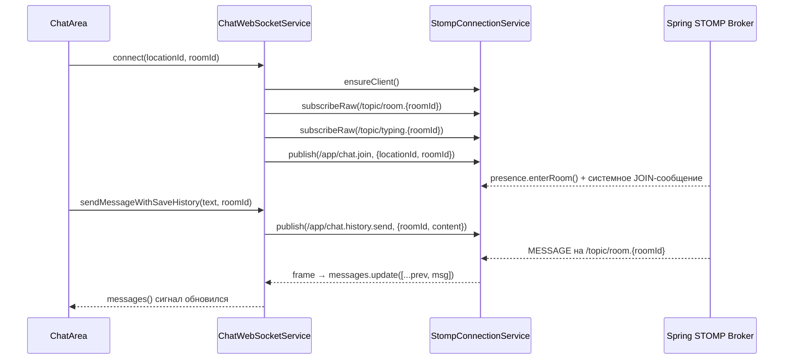
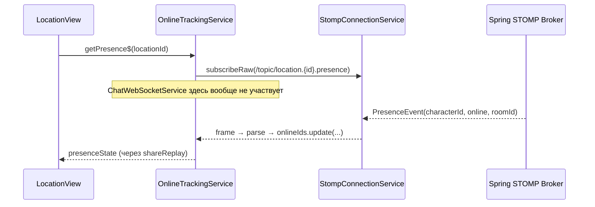

# Архитектура: StompConnectionService и ChatWebSocketService

## Идея в одном абзаце

`StompConnectionService` — это низкоуровневая обёртка над **одним физическим STOMP-соединением** на всё приложение (connect/disconnect, publish, subscribe на любой топик). `ChatWebSocketService` — высокоуровневый сервис **конкретно для чата** (сообщения, история комнаты, typing-индикатор), который использует `StompConnectionService` как транспорт. Это не единственный потребитель — presence-сервисы (`OnlineTrackingService`, `OnlineTrackingSidebarService`) подписываются на свои топики через `StompConnectionService` **напрямую**, минуя `ChatWebSocketService` полностью.

---

## Два уровня абстракции



**Ключевой момент:** `StompConnectionService` не знает ничего ни про чат, ни про presence — он просто даёт универсальные примитивы `subscribeRaw(destination, callback)` и `publish(destination, body)`. Любой сервис в приложении может подписаться на любой топик напрямую, не проходя через `ChatWebSocketService`.

---

## `StompConnectionService` — что он даёт

Предполагаемый публичный интерфейс (транспортный уровень):

```typescript
class StompConnectionService {
  connected: Signal<boolean>;

  ensureClient(): void;                                    // создать/переиспользовать STOMP-клиент
  onConnect(callback: () => void): void;                   // хук на (пере)подключение
  disconnect(): void;

  subscribeRaw(destination: string, callback: (frame: IMessage) => void): StompSubscription;
  publish(destination: string, body: string): void;
}
```

- **Один клиент на всё приложение** — сколько бы сервисов ни вызывали `ensureClient()`, физическое WS-соединение одно.
- **`subscribeRaw`** — тонкая обёртка над `client.subscribe(destination, callback)` из `@stomp/stompjs`; ничего не парсит и не интерпретирует payload — это забота вызывающего сервиса.
- **`onConnect`** — нужен, чтобы каждый потребитель мог довосстановить свои подписки после разрыва и переподключения (STOMP не помнит старые подписки автоматически при реконнекте).

---

## `ChatWebSocketService` — специфичная надстройка для чата



### За что отвечает

| Функциональность | Метод |
|---|---|
| Подключиться + войти в комнату | `connect(locationId, roomId)` |
| Отправить сообщение | `sendMessageWithSaveHistory(content, roomId)` |
| Переключиться между комнатами без разрыва соединения | `switchRoom(locationId, newRoomId)` |
| Индикатор "печатает..." | `sendTyping(roomId)`, сигнал `typingUsers` |
| Список сообщений текущей комнаты | сигнал `messages` |
| Отслеживание удалённых сообщений | сигнал `deletedMessageIds` |

### Внутреннее состояние

- `currentRoomId` / `currentLocationId` — какая комната сейчас активна.
- `topicRoomSub` / `typingSub` — активные подписки, которые нужно закрывать при смене комнаты (`switchRoom`) — иначе накапливаются "мёртвые" подписки на старые топики.
- `stomp.onConnect(...)` в конструкторе — довосстанавливает подписку на текущую комнату после разрыва соединения (например, кратковременная потеря сети).

> ⚠️ **Важный нюанс (реальный найденный баг):** `connect()`, в отличие от `switchRoom()`, изначально не проверял, не подписаны ли уже на ту же самую комнату, и не отписывался от предыдущей подписки перед созданием новой. Если `connect()` вызывался повторно для одной и той же комнаты (например, из `effect()` в `ChatArea`, реагирующего на смену ссылки объекта `room()`/`location()` без реальной смены комнаты) — подписки на `/topic/room.{roomId}` накапливались, и каждое входящее сообщение приходило по стольку раз, сколько раз была вызвана `connect()`. Исправлено: `connect()` теперь имеет ту же guard-проверку (`currentRoomId === roomId && currentLocationId === locationId → return`) и отписку от предыдущей подписки перед новой, как и `switchRoom()`.

---

## Presence-сервисы: используют STOMP напрямую, без ChatWebSocketService



`OnlineTrackingService` и `OnlineTrackingSidebarService` — независимые сервисы, каждый со своим кешем и своей логикой (см. `presence-architecture.md`). Они вызывают `StompConnectionService.subscribeRaw(...)` напрямую на **своих** топиках (`/topic/location.{id}.presence`, `/topic/locations.presence-counts`), никак не завязываясь на `ChatWebSocketService`. Это подтверждает главный тезис: **`StompConnectionService` — универсальный транспорт, а не часть чата**; чат — лишь один из его потребителей.

---

## Почему это разделение полезно

| | Если бы всё было в одном сервисе | С разделением на 2 уровня |
|---|---|---|
| Presence система | Пришлось бы либо дублировать STOMP-клиент, либо тащить зависимость от `ChatWebSocketService` (нарушение single responsibility) | Использует транспорт напрямую, не зная о чате вообще |
| Тестируемость | Мокать весь чат ради теста presence | Мокается только `StompConnectionService` |
| Добавление новой фичи (например, уведомления) | Пришлось бы встраивать в `ChatWebSocketService` | Новый независимый сервис поверх того же `StompConnectionService` |
| Соединение | Каждый feature-сервис держал бы своё WS-соединение | Одно физическое соединение на всё приложение |

---

## Итоговая схема "кто на что подписан"

| Топик | Кто подписывается | Через какой сервис |
|---|---|---|
| `/topic/room.{roomId}` | `ChatArea` | `ChatWebSocketService` → `StompConnectionService` |
| `/topic/typing.{roomId}` | `ChatArea` | `ChatWebSocketService` → `StompConnectionService` |
| `/topic/location.{id}.presence` | `LocationView` | `OnlineTrackingService` → `StompConnectionService` |
| `/topic/locations.presence-counts` | `SidebarComponent` (через все `LocationItem`) | `OnlineTrackingSidebarService` → `StompConnectionService` |

Все — через один и тот же `StompConnectionService`, но каждый сервис инкапсулирует свою бизнес-логику отдельно и не знает о существовании других.
